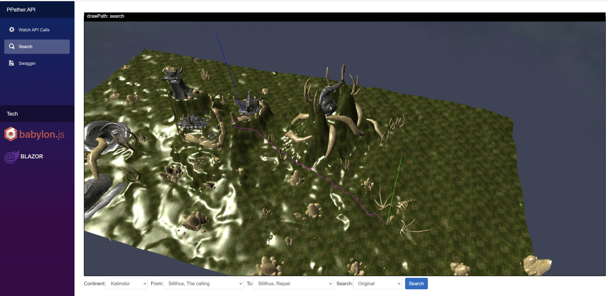

  

# MasterOfPuppets - World of Warcraft Classic Grind Bot - Now Includes Pathing

- Uses a modified version of the addon: https://github.com/FreeHongKongMMO/Happy-Pixels to read the game state. 

- Uses Blazor Server to show the bot state in a browser, and so can be monitored from your phone or a tablet while you do something else.
https://docs.microsoft.com/en-us/aspnet/core/blazor

- No DLL injection or memory watching, just screen capture, mouse and keyboard clicking.

- The bot was written from scratch in C#. The Pathing calculation is mostly from an old library called [PPather](https://github.com/namreeb/PPather).

- Most of the classes should work.

- Pathing to grind route, vendor and repair. Indoors pathfinding only works properly if `PathFilename` is exists.

- Further detail about the bot can be found in my [Blog post](http://www.codesin.net/post/wowbot/).

# Video

https://www.youtube.com/watch?v=CIMgbh5LuCc

# Contributing

You are welcome to create pull requests. Some ideas of things that could be improved:

* This readme
* The stuck detector
* The route recording and editing
* More routes

# Contribution

* Runtime Class Profile picker
* Runtime Path Profile autocomplete search
* Frontend Dark mode
* Improved Loot Goals
* Introduced a concept of Produce/Consume corpses. In short killing multiple enemies in a single combat, can loot and skin them all.
* Actionbar populator based on class config
* DataConfig: change where the external data(DBC, MPQ, profiles) can be found
* Added Skinning ability
* Edit the loaded profile from frontend
* Navigation Path simplification
* NPCNameFinder: extended to friendly/neutral units
* Support game windowed mode
* Remap essential keybindings and support more action bar slots up to 36
* Updated low level Warlock/Mage profiles
* Added Warlock shard farming profile
* Added a new input system to handle modifier keys
* Support more 4:3 aspect ratio based resolution
* Added lot path profiles including TBC
* System wide DPI should work from win 7
* Added basic support for Hunter, Shaman classes
* More Pet support
* Exclude ammo pouch and quiver from containers
* ActionBarSlot usable
* Retrive ActionBarSlot power cost to get more precise resource usage
* Addon supports all available languages

# Issues and Ideas

Create an issue rather than emailing me so that others can comment.

# Getting it working

## 1. Download this repository

Put the contents of the repo into a folder. e.g "C:\WowClassicGrindBot". I am going to refer to this folder from now on, so just substitute your own folder path.

## 2. Download the MPQ route files

You only need the common-2.MPQ (1.7Gb) file which you can get here: https://drive.google.com/file/d/1k80qqC02Xvpxfy5JQjzAkoixj8b4-EEP/view?usp=sharing

This file is required to find paths from where you are to the grind area, vendor and repair.

Copy it into the \Json\MPQ folder (e.g. C:\WowClassicGrindBot\Json\MPQ)

For TBC you have to download expansion.MPQ (1.8Gb) can get here: https://mega.nz/file/Of4i2YQS#egDGj-SXi9RigG-_8kPITihFsLom2L1IFF-ltnB3wmU
and copy next to the common-2.MPQ file. 

## 3. System Requirements

1. Nvidia Control panel settings
    * Make sure the `Image Sharpening` under the `Manage 3D Settings`-> Global settings or Program Settings(for WoW) is set to `Sharpening Off, Scaling disabled`!

## 4. Build the bot

You will probably already have Visual Studio or Visual Studio Code installed. You need to build the bot using either one of them, or use powershell.

You will need .net core 3.1 x86 SDK installed. https://dotnet.microsoft.com/download/dotnet-core/3.1 

Note: you need the x86 version, not the x64 one.

e.g. Build from powershell

    cd C:\WowClassicGrindBot
    dotnet build

## 5. Configuration process

The bot reads the game state using small blocks of colour shown at the top of the screen by an Addon. This needs to be configured.

1. Edit the batch script in c:\WowClassicGrindBot\BlazorServer called run.bat, change it to point at where you have put the repo BlazorServer folder e.g.

        start "C:\Program Files (x86)\Google\Chrome\Application\chrome.exe" "http://localhost:5000"
        c:
        cd C:\WowClassicGrindBot\BlazorServer
        dotnet run
        pause

2. Execute the `run.bat`. This will start the bot and Chrome, Wow must be already running. If you get "Unable to find the Wow process is it running ?" in the console window then it can't find wow.exe.

3. Check these settings in the wow game client. Other values will stop the bot from being able to read the addon data.

  * System>Advanced>Constrast: 50
  * System>Advanced>Brightness: 50
  * System>Advanced>Gamma from: 1.0
  * System>Render Scale: 100%
  * Disable Glow effect - type in the chat `/console ffxGlow 0` - to keep/save this settings make sure to properly shutdown the game.

4. When running the BlazorServer for the first time you will have to follow a setup process:
    1. Just start the game and wait in the character selection screen.
    2. Click `2. Addon Configuration`
    3. Click `Find InstallPath` -> `InstallPath` should be filled otherwise, fill out manually
    4. Fill the `Author`
    5. Fill the `Title`
    6. Then press `Install & Save` button -> Log should see `AddonConfigurator.Install successful`
    7. Required to restart the Game 
    8. Enter world with your desired character
    9. Click `5. Frame Configuration`
    10. Click `Auto Configure and Restart`

5. Under the `Addon Configuration` you can check if theres a newer version available for the addon. In that case just press the `install` button then have to restart the game client and the bot it self in order to use it properly. 

## 5. The bot should restart and show the dashboard page.

## 6. Configure the Wow Client - Interface Options

We need to make sure that certain interface options are set. The most important are Click to move and screen flashing on low health. See the list below.

### Interface Options

From the main menu (ESC) set the following under Interface Options:

* Controls - Auto Loot - Ticked.
* Controls - Interact on Left click - Not ticked.
* Combat - Do Not Flash Screen at Low Health - Ticked.
* Combat - Auto Self Cast - Ticked.
* Names - NPC Names - Ticked.
* Names - Enemy Units (V) - Not ticked.
* Camera - Auto-Follow Speed - Fast
* Camera - Camera Following Style - Always
* Mouse - Click-to-Move - Ticked
* Mouse - Click-to-Move Camera Style - Always

## 7. Configure the Wow Client - Key Bindings:

The "Interact with Target" keybind is super important as it allows the bot to turn towards and approach the target.
The "Target Last Target " keybind helps with looting.

From the main menu (ESC) set the following:

"Movement Keys" Key Bindings:
| Command | Key | ClassConfiguration KeyAction | Desciption |
| ---- | ---- | ---- | ---- |
| Jump | Spacebar | JumpKey | ---- |
| Sit/Move Down | X | StandUpKey | Used after drinking or eating |

"Targeting" Key Bindings:

| Command | Key | ClassConfiguration KeyAction | Desciption |
| ---- | ---- | ---- | ---- |
| Target Nearest Enemy | Tab | TargetNearestTargetKey | ---- |
| Target Pet | Multiply | TargetPetKey | Only pet based class |
| Target Last Target | G | TargetLastTargetKey | ---- |
| Interact With Target | I | InteractKey | ---- |
| Assist Target | F | TargetTargetOfTargetKey | ---- |
| Pet attack | Subtract | PetAttackKey | Only pet based class |

## 7.1. Actionbar Key Bindings:

The default class profiles assumes the following `Keybinds` setup and using English Keyboard layout.
In total, `32` key supported.
Highly recommended to use the default setup, in order to get properly working the `ActionBarSlotCost` and `ActionBarSlotUsable` features! 
https://wowwiki-archive.fandom.com/wiki/ActionSlot

| ActionSlot | Key | Description |
| --- | --- | --- |
| 1-10 | 1,2,3 .. 9,0 | 0 is the 10th key |
| Bottom Right ActionBar | - | - |
| 49-58 | N1,N2,N3 .. N9,N0 | N means Numpad - 0 is the 10th key |
| Bottom Left ActionBar | - | - |
| 61-72 | F1,F2,F3 .. F11,F12 | F means Functions |

## 8. Configure the Wow Client - Bindpad addon

Bindpad allows keys to be easily bound to commands and macros. Type /bindpad to show it.

For each of the following click + to add a new key binding.

|  Key |  Command |
| ---- | ---- |
| Delete | /stopattack /stopcasting /petfollow |
| Insert | /cleartarget |

    Rogue weapon buff (use 17 for second weapon):
        /use Instant Poison V 
        /use 16
        /click StaticPopup1Button1 

    Melee weapon buff:
        /use Dense Sharpening Stone
        /use 16
        /click StaticPopup1Button1         

    Delete various
        /run for b=0,4 do for s=1,GetContainerNumSlots(b) do local n=GetContainerItemLink(b,s) if n and (strfind(n,"Slimy") or strfind(n,"Red Wolf") or strfind(n,"Mystery") or strfind(n,"Spider L")) then PickupContainerItem(b,s) DeleteCursorItem() end end end

## 9. Setting up the class file (Final step)

Each class has a configuration file in /Json/class e.g. the config for a Rogue it is in file C:\WowClassicGrindBot\Json\class\Rogue.json.

The configuration file determines what spells you cast when pulling and in combat, where to vend and repair and what buffs you give yourself.

Take a look at the class files in /Json/class for examples of what you can do (BTW hunter is not supported.). Your class file probably exists and just needs to be edited to set the pathing file name, but note they may be set up for level 60.

### Path

The path that the class follows is a json file in C:\WowClassicGrindBot\Json\path\ which contains a list of x & y coordinates the bot will traverse while looking for mobs.

        "PathFilename": "58_Winterspring.2.json", // the path to walk when alive
        "PathThereAndBack": true, // if true walks the path and the walks it backwards.
        "PathReduceSteps": true,  // uses every other coordinate.

### Commands(KeyAction)

The rest of the file contains a set of commands 

e.g.

    {
        "Name": "Slice And Dice",
        "Key": "3",
        "MinEnergy": 25,
        "MinComboPoints": 2,
        "Cooldown": 3,
        "Requirement": "Slice And Dice"
      }, 

Commands have the following parameters, only a subset will be used by each command.

| Property Name | Description | Default value |
| --- | --- | --- |
| Name | Name of the command. For the ActionBar populator, if you use full lowercase names thats means its a macro. | |
| HasCastBar | Does the spell have a cast bar | false |
| StopBeforeCast | Should the char stop moving before casting the spell | false |
| Key | The key to click (ConsoleKey) | |
| PressDuration | How many milliseconds to press the key for |  50 |
| ShapeShiftForm | For druids the shapeshift form to be in to cast this spell | None |
| CastIfAddsVisible | If the bot can "See" any adds | false |
| Charge | How many times shoud this Command be used in sequence and ignore its Cooldown | 1 |
| Cooldown | The cooldown in seconds until the command can be done again | 0 |
| MinMana | (Optional) The minimum Mana required to cast the spell | 0 |
| MinRage | (Optional) The minimum Rage required to cast the spell | 0 |
| MinEnergy | (Optional) The minimum Energy required to cast the spell | 0 |
| MinComboPoints | The minimum combo points required to cast the spell | 0 |
| WhenUsable | When not in cooldown and have the min resource(mana,rage,energy) to use it. | false |
| Requirement | A single "Requirement" (See below) which must be true | |
| Requirements | A list of "Requirements" which must be true |  |
| WaitForWithinMelleRange| Wait after casting for the mob to be in melee range | false |
| ResetOnNewTarget | Reset the cooldown if the target changes | false |
| Log | Write to the log when this key is evaluated | true |
| DelayBeforeCast | A delay in milliseconds before this spell is cast | 0 |
| DelayAfterCast | The delay in milliseconds after the spell is cast | 1450 |
| AfterCastWaitBuff | After the cast happened, should wait until player buffs changed | false |
| Cost | For Adhoc goals the priority | 18 |
| InCombat | Can it be cast in combat | false |
| StepBackAfterCast | Hero will go back for X milliseconds after casting this spell , usable for spells like Mage Frost Nova | 0 |
| PathFilename | For NPC goals, this is a short path to get close to the NPC to avoid walls etc. | "Tanaris_GadgetzanKrinkleGoodsteel.json" |

### Pull Goal

This is the sequence of commands that are used when pulling a mob.

### Combat Goal

The sequence of commands that are used when in combat and trying to kill a mob. The combat goal does the first available command on the list. The goal then runs again re-evaluating the list before choosing the first available command again, and so on until the mob is dead.

### Adhoc Goals

These commands are done when not in combat and are not on cooldown.

### NPC Goals

These command are for vendoring and repair.

e.g.

    "NPC": {
          "Sequence": [
            {
              "Name": "Repair",
              "Key": "C",
              "Requirement": "Items Broken",
              "PathFilename": "Tanaris_GadgetzanKrinkleGoodsteel.json",
              "Cost": 6
            },
            {
              "Name": "Sell",
              "Key": "C",
              "Requirement": "BagFull",
              "PathFilename": "Tanaris_GadgetzanKrinkleGoodsteel.json",
              "Cost": 6
            }
          ]
      }

The "Key" is a key that is bound to a macro. The macro needs to target the NPC, and if necessary open up the repair or vendor page. The bot will click the key and the npc will be targetted. Then it will click the interact button which will cause the bot to move to the NPC and open the NPC options, this may be enough to get the auto repair and auto sell greys to happen. But the bot will click the button again in case there are further steps (e.g. SelectGossipOption), or you have many greys or items to sell.

Sell macro example bound to the "C" key using BindPad or Key bindings.

    /tar Jannos Ironwill
    /run DataToColor:sell({"Light Leather","Cheese","Light Feather"});

Repair macro example:

    /tar Vargus
    /script SelectGossipOption(1)

Spammable wand macro `shoot` in many profiles

    /#showtooltip
    /cast !shoot

Warlock `pull` macro used in warlock profiles

    #showtooltip
    /cast Immolate

Warlock `heal` macro used in warlock profiles.

    #showtooltip
    /cast Create Healthstone
    /use Minor Healthstone
    /use Lesser Healthstone
    /use Healthstone
    /use Greater Healthstone
    /use Major Healthstone
    /use Master Healthstone

Hunter `autoshot` spammable Auto Shoot macro

    #showtooltip
    /cast !Auto Shot

Hunter `feedpet` macro replace `Roasted Quail` with the proper diet

    #showtooltip
    /cast Feed Pet
    /use Roasted Quail

Hunter `sumpet` macro

    #showtooltip
    /cast [target=pet,dead] Revive Pet
    /cast [target=pet,noexists] Call Pet

Because some NPCs are hard to reach, there is the option to add a short path to them e.g. "Tanaris_GadgetzanKrinkleGoodsteel.json". The idea is that the start of the path is easy to get to and is a short distance from the NPC, you record a path from the easy to reach spot to the NPC with a distance between spots of 1. When the bot needs to vend or repair it will path to the first spot in the list, then walk closely through the rest of the spots, once they are walked it will press the defined Key, then walk back through the path.

e.g. Tanaris_GadgetzanKrinkleGoodsteel.json in the Json\path folder looks like this:

    [{"X":51.477,"Y":29.347},{"X":51.486,"Y":29.308},{"X":51.495,"Y":29.266},{"X":51.503,"Y":29.23},{"X":51.513,"Y":29.186},{"X":51.522,"Y":29.147},{"X":51.531,"Y":29.104},{"X":51.54,"Y":29.063},{"X":51.551,"Y":29.017},{"X":51.559,"Y":28.974},{"X":51.568,"Y":28.93},{"X":51.578,"Y":28.889},{"X":51.587,"Y":28.853},{"X":51.597,"Y":28.808}]

If you have an NPC that is easy to get to such as the repair NPC in Arathi Highlands then the path only needs to have one spot in it. e.g.

    [{"X":45.8,"Y":46.6}]

Short Path Example:

### Repeatable Quests Handin

In theory if there is a repeatable quest to collect items, you could set up a NPC task as follows. See 'Bag requirements' for Requirements format.

    {
        "Name": "Handin",
        "Key": "K",
        "Requirements": ["BagItem:12622:5","BagItem:12623:5"],
        "PathFilename": "Path_to_NPC.json",
        "Cost": 6
    }

## Requirement

A requirement is something that must be true for the command to run. Not all commands need a requirement, some just rely on a cooldown or a mana amount. A requirement can be put into a list if there is more than one.

e.g.

      {
        "Name": "Soul Shard",
        "Key": "9",
        "HasCastBar": true,
        "Requirements": ["TargetHealth%<36", "not BagItem:6265:3"], <--- Requirement List
        "MinMana": 55
      },
      {
        "Name": "Curse of Weakness",
        "Key": "6",
        "Cooldown": 10,
        "ResetOnNewTarget": true,
        "Requirement": "not Curse of Weakness", <--- Single Requirement
        "MinMana": 20,
        "Log": false
      },

#### Value base requirements

Value base requirements are made up on a [ `Health%` or `TargetHealth%` or `PetHealth%` or `Mana%` or `BagCount` or `MobCount` or `MinRange` or `MaxRange`] [< or >] [Numeric Value].

e.g.
* "Health%>70",
* "TargetHealth%<10",
* "PetHealth%<10",
* "Mana%<40",
* "BagCount>80",
* "MobCount>1",
* "MinRange<5",
* "MinRange>15",
* "MaxRange>20",
* "MaxRange>35",

For the `MinRange` and `MaxRange` gives an approximation to the target distance to the player

| MinRange | MaxRange | alias Description |
| --- | --- | --- |
| 0 | 5 | "InMeleeRange" |
| 5 | 15 | "IsInDeadZoneRange" |
| 15 | 20 | "InCombatRange" |
| 20 | 30 | "InCombatRange" |
| 30 | 35 | "InCombatRange" |
| 35 | 40 | "OutOfCombatRange" |
| 35 | 99 | "OutOfCombatRange" |
| 40 | 45 | "OutOfCombatRange" |
| 45 | 99 | "OutOfCombatRange" |

#### npcID requirements

If a particular npc is required then this requirement can be used.

e.g.
* "not npcID:6195", - don't cast on npcId 6195 https://classic.wowhead.com/npc=6195
* "npcID:6195", - only cast on npcId 6195 https://classic.wowhead.com/npc=6195

#### Mob count requirements

If you only want to cast a spell if there is more than one mob fighting you e.g. Frost nova, or Cleave etc.

e.g. "Requirement": "MobCount>1",

#### Bag requirements

If an item must be in your bag then you can use this requirement. Useful to determine when to create warlock Healthstone or soul shards.

It has the format BagItem:[itemid]:[count]

e.g. 
* "BagItem:6265:1 - Must have a soulshard in the bag https://classic.wowhead.com/item=6265
* "not BagItem:19007:1" - Must have a lesser Healthstone in the bag https://classic.wowhead.com/item=19007
* "not BagItem:6265:3"- Must not have 3 soulshards in the bag.

#### Buff / Debuff

Allow requirements about what buffs you have or the target has to be evaluated.

e.g.
* "not Well Fed" - I am not well fed.
* "not Thorns" - I don't have the thorns buff.
* "AutoAttacking" - Attack spell enabled.
* "Shooting" - I am out of shooting.
* "Items Broken" - Some of my armor is red.
* "BagFull" - player inventory is full.
* "HasRangedWeapon" - player has an item equipped at the ranged slot.
* "InMeleeRange" - determines if the target is in melee range (0-5 yard)

| Condition | Desciption |
| --- | --- |
| "TargetYieldXP" | The target yields experience upon death. (Grey Level) |
| --- | --- |
| "Has Pet" | The player's pet is alive |
| "Pet Happy" | Only true when the pet happienss is green |
| --- | --- |
| "BagFull" | Inventory is full |
| "Items Broken" | Has any broken(red) worn item |
| "HasRangedWeapon" | Has equipped ranged weapon (wand/crossbow/bow/gun) |
| "HasAmmo" | AmmoSlot has equipped ammo and count is greater than zero |
| --- | --- |
| "InMeleeRange" | Target is approximately 0-5 yard range |
| "InDeadZoneRange" | Target is approximately 5-11 yard range |
| "InCombatRange" | Class based - Have any ability which allows you to attack target from current place |
| "OutOfCombatRange" | Negated value of "InCombatRange" |
| --- | --- |
| "AutoAttacking" | Auto spell `Auto Attack` is active |
| "Shooting" | (wand) Auto spell `Shoot` is active |
| "AutoShot" | (hunter) Auto spell `Auto Shot` is active |
| --- | --- |
| "HasMainHandEnchant" | Indicates that main hand weapon has active poison/sharpening stone/shaman buff effect |
| "HasOffHandEnchant" | Indicates that off hand weapon has active poison/sharpening stone/shaman buff effect |

| Class | Buff Condition |
| --- | --- |
| All | "Well Fed" |
| All | "Eating" |
| All | "Drinking" |
| All | "Mana Regeneration" |
| --- | --- |
| Druid | "Mark of the Wild" |
| Druid | "Thorns" |
| Druid | "TigersFury" |
| Mage | "Frost Armor" |
| Mage | "Ice Armor" |
| Mage | "Arcane Intellect" |
| Mage | "Ice Barrier" |
| Mage | "Ward" |
| Mage | "Fire Power" |
| Mage | "Mana Shield" |
| Paladin | "Seal" |
| Paladin | "Aura" |
| Paladin | "Blessing" |
| Paladin | "Blessing of Might" |
| Priest | "Fortitude" |
| Priest | "InnerFire" |
| Priest | "Divine Spirit" |
| Priest | "Renew" |
| Priest | "Shield" |
| Rogue | "Slice And Dice" |
| Warlock | "Demon Armor" |
| Warlock | "Demon Skin" |
| Warlock | "Shadow Trance" |
| Warlock | "Soulstone Resurraction" |
| Warlock | "Soul Link" |
| Warrior | "Battle Shout" |
| Shaman | "Lightning Shield" |
| Shaman | "Water Shield" |
| Shaman | "Shamanistic Focus" |
| Hunter | "Aspect of the Cheetah" |
| Hunter | "Aspect of the Pack" |
| Hunter | "Aspect of the Beast" |
| Hunter | "Aspect of the Hawk" |
| Hunter | "Aspect of the Wild" |
| Hunter | "Aspect of the Monkey" |
| Hunter | "Rapid Fire" |
| Hunter | "Quick Shots" |

| Class | Debuff Condition |
| --- | --- |
| Druid | "Demoralizing Roar" |
| Druid | "Faerie Fire" |
| Mage | "Frostbite" |
| Priest | "Shadow Word: Pain" |
| Warlock | "Curse of" |
| Warlock | "Curse of Weakness" |
| Warlock | "Curse of Elements" |
| Warlock | "Curse of Recklessness" |
| Warlock | "Curse of Shadow" |
| Warlock | "Curse of Agony" |
| Warlock | "Siphon Life" |
| Warlock | "Corruption" |
| Warlock | "Immolate" |
| Warrior | "Rend" |
| Hunter | "Serpent Sting" |

#### Range

Allow requirements about spell range to be used, the spell in question depends upon the class being played.
"SpellInRange:0" or "not SpellInRange:0" for a Warrior is Charge and for a Mage is Fireball. This might be useful if you were close enough for a Fireball, but not for a Frostbolt.

e.g. "Requirement": "SpellInRange:4"
e.g. "Requirements": ["Health%<80", "SpellInRange:4"]

In the Addon DataToColor.lua is function DataToColor:areSpellsInRange() this tries to get a list of spells unique to each class that are in range. This is read by Libs.SpellInRange.cs.

| Class | Spell | id |
| --- | --- | --- |
| ROGUE | Sinister Strike | 0 |
| ROGUE | Throw | 1 |
| ROGUE | Shoot Gun | 2 |
| --- | --- | --- |
| DRUID | Wrath | 0 |
| DRUID | Bash| 1 |
| --- | --- | --- |
| WARRIOR | Charge | 0 |
| WARRIOR | Rend | 1 |
| WARRIOR | Shoot Gun | 2 |
| --- | --- | --- |
| PRIEST | Shadow Word: Pain | 0 |
| PRIEST | Mind Blast | 1 |
| PRIEST | Mind Flay | 2 |
| PRIEST | Shoot | 3 |
| --- | --- | --- |
| PALADIN | Judgement | 0 |
| --- | --- | --- |
| MAGE | Fireball | 0 |
| MAGE | Shoot| 1 |
| MAGE | Pyroblast | 2 |
| MAGE | Frostbolt | 3 |
| MAGE | Fire Blast | 4 |
| --- | --- | --- |
| HUNTER | Raptor Strike | 0 |
| HUNTER | Auto Shot | 1 |
| --- | --- | --- |
| WARLOCK | Shadow Bolt | 0 |
| WARLOCK | Shoot | 1 |
| --- | --- | --- |
| SHAMAN | Lightning Bolt | 0 |
| SHAMAN | Earth Shock | 1 |

----

# Modes

The default mode for the bot is to grind, but there are other modes. The mode is set in the root of the class file.

e.g. Rogue.json

    {
      ...

      "PathFilename": "Herb_EPL.json",
      "Mode": "AttendedGather", // <---------
      "GatherFindKeys":  [1,2],
    }

The available modes are:

| Mode | Description |
| --- | --- |
| "Grind" | This is the default mode where the bot will pull mobs and follow a route |
| "CorpseRun" | This mode only has 2 goals. The "Wait" goal waits while you are alive. The "CorpseRun" will run back to your corpse when you die. This can be useful if you are farming an instance and die, the bot will run you back some or all of the way to the instance entrance. |
| "AttendedGather" | When this mode is active and the Gather tab in the UI is selected, it will run the path and scan the minimap for the yellow nodes which indicate a herb or mining node. When it finds a node it will stop and alert you by playing a youtube video, you will then have to manually pick the herb/mine and then start the bot again. |
| "AttendedGrind" | This is useful if you want to control the path the bot takes, but want it to pull and kill any targets you select. |

# User Interface

## Other devices

The user interface is shown in a browser on port 5000 http://localhost:5000. This allows you to view it from another device on your lan.

To access you PC port 5000 from another device, you will need to open up port 5000 in your firewall.

Control Panel\System and Security\Windows Defender Firewall - Advanced Settings

* Inbound Rules
* New Rule
* Port
* TCP
* Specific local ports: 5000
* Allow the Connection
* Private, Public, Domain (You may get away with just Private)
* Name "Wow bot"

## Components

The UI has the following components:

### Screenshot

### Player Summary

Show the player state. A hyper link to wowhead appears for the mob you are fighting so you can check out what it drops.

### Route

This component shows:

* The main path
* The spirit healer path
* Your location
* The location of any deaths
* Pathed routes

Pathed routes are shown in Green.

### Goals

This component contains a button to allow the bot to be enabled and disabled.

This displays the finite state machine. The state is goal which can run and has the highest priority. What determines if the goal can run are its pre-conditions such as having a target or being in combat. The executing goal is allowed to complete before the next goal is determined.

Some goals (combat,pull target) contain a list of spells which can be cast. The combat task evaluates its spells in order with the first available being cast. The goal then gives up control so that a higher priority task can take over (e.g. Healing potion).

The visualisation of the pre-conditions and spell requirements makes it easier to understand what the bot is doing and determine if the class file needs to be tweaked.

# Recording a Path

Various path are needed by the bot:

The path to run when grinding (PathFilename in root of class files).

    "PathFilename": "16_LochModan.json",
    "PathThereAndBack": true,
    "PathReduceSteps": false,

The short path to get to the vendor/repairer when there are obstacles close to them (PathFilename withing NPC task):

    {
        "Name": "Sell",
        "Key": "C",
        "Requirement": "BagFull",
        "PathFilename": "Tanaris_GadgetzanKrinkleGoodsteel.json",
        "Cost": 6
    }

## Recording a new path

To record a new path place your character where the start of the path should be, then click on the 'Record Path' option on the left hand side of the bot's browser window. Then click 'Record New'.

Now walk the path the bot should take.

If you make a mistake you can remove spots by clicking on them on the list on the right. Then either enter new values for the spot or click 'Remove'.

For tricky parts you may want to record spots close together by using the 'Distance between spots' slider (Smaller number equals closer together).

Once the path is complete click 'Save'. This path will be saved with a generic filename e.g.  Path_20201108112650.json, you will need to go into your \Json\path and rename it to something sensible.

## Types of paths

### There and back 

"PathThereAndBack": true,

These paths are run from one end to the other and then walked backwards back to the start. So the end does not need to be near the start.

### Joined up

"PathThereAndBack": false,

These paths are run from one end to the other and then repeated. So the path needs to join up with itself i.e. the end needs to be near the start.

## Tips  

Try to avoid the path getting too close to:

* Obstactles like trees, houses.
* Steep hills or cliffs (falling off one can make the bot get stuck).
* Camps/groups of mobs.
* Elite mob areas, or solo elite paths.

The best places to grind are:

* Places with non casters i.e. beasts. So that they come to you when agro'd.
* Places where mobs are far apart (so you don't get adds).
* Places with few obstacles.
* Flat ground.

# Pathing

Pathing is built into the bot so you don't need to do anything special except download the MPQ files. You can though run it on its own server to visualise routes as they are created by the bot, or to play with route finding.

The bot will try to calculate a path in the following situations:

* Travelling to a vendor or repair.
* Doing a corpse run.
* Resuming the grind path at startup, after killing a mob, or if the distance to the next stop in the path is not a short distance.

## Video:

https://www.youtube.com/watch?v=Oz_jFZfxSdc&t=254s&ab

## Running on its own server.

In visual studio just set PathingAPI as the startup project or from the command line:

CD C:\WowClassicGrindBot\PathingAPI
dotnet run

Then in a browser go to http://localhost:5001

There are 3 pages:

* Watch API Calls
* Search
* Swagger

Requests to the API can be done in a new browser tab like this or via the Swagger tab. You can then view the result in the Watch API calls viewer.

    e.g. http://localhost:5001/api/PPather/MapRoute?map1=1446&x1=51.0&y1=29.3&map2=1446&x2=38.7&y2=20.1

Search gives some predefined locations to search from and to.

## Running it along side the bot

In visual studio right click the solution and set Multiple startup projects to BlazorServer and PathingApi and run.

Or from 2 command lines dotnet run each.

    CD C:\WowClassicGrindBot\PathingAPI
    dotnet run

    CD C:\WowClassicGrindBot\BlazorServer
    dotnet run

## As a library used within the bot

The bot will use the PathingAPI to work out routes, these are shown on the route map as green points.

